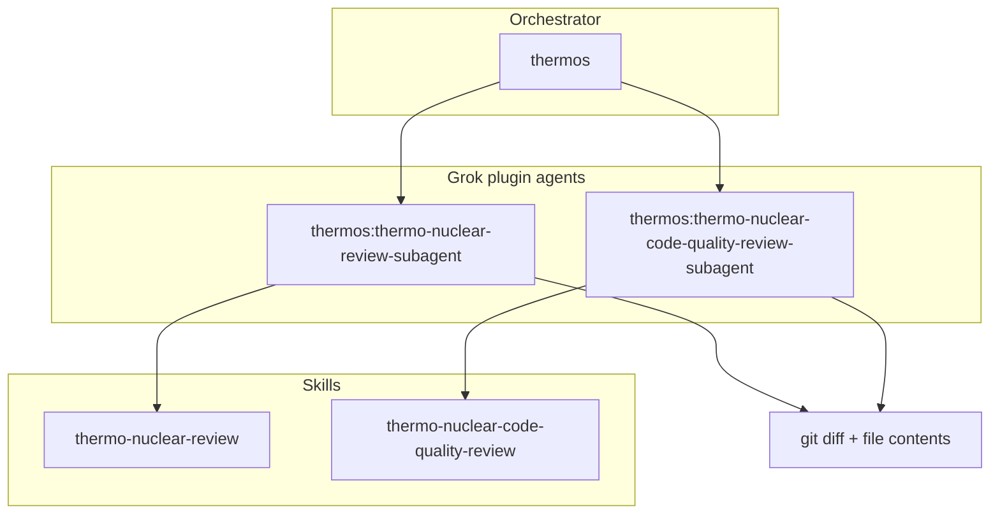

# thermos

Thermo-nuclear dual-rubric branch review for Grok Build: deep correctness and security audits, harsh maintainability rubrics, parallel Grok `spawn_subagent` reviewers, synthesize, and poteto bind (arena / interrogate / swarm handoff / lever VERIFY).

## Install

Requires marketplace add (host shell if nested grok hits EROFS on `config.toml`):

```bash
grok plugin marketplace add tommy-ca/grok-build-plugins
grok plugin install thermos --trust
grok plugin enable thermos
```

Start a **new session** after enable. Live roles are `inspect.agents[]`. Spawn `thermos:thermo-nuclear-review-subagent` and `thermos:thermo-nuclear-code-quality-review-subagent`, not bare stems.

## Architecture



## Skills

| Skill | Description |
|:------|:------------|
| `thermo-nuclear-review` | Deep branch audit (bugs, breakages, security, devex, feature-gate leaks). |
| `thermo-nuclear-code-quality-review` | Strict maintainability audit (code-judo, 1k-line rule, spaghetti, boundaries). |
| `thermos` | Gather context, launch both reviewers via `spawn_subagent`, join, synthesize. |

## Agents

| Agent | Spawn as |
|:------|:---------|
| `thermo-nuclear-review-subagent` | `thermos:thermo-nuclear-review-subagent` |
| `thermo-nuclear-code-quality-review-subagent` | `thermos:thermo-nuclear-code-quality-review-subagent` |

## Typical usage (double review)

1. Gather `git diff main...HEAD` and full contents of changed files.
2. In **one** message, `spawn_subagent` both `thermos:`-qualified reviewers with `background: true`.
3. Join with `get_command_or_subagent_output` (`task_ids`, `timeout_ms` > 0).
4. Synthesize prioritized, deduped findings.

See [HARNESS.md](./HARNESS.md). Cancel with `kill_command_or_subagent`.

## Poteto surfaces

| Surface | Role |
|---|---|
| arena | Contested port/design forks |
| interrogate | Post-apply stacked review with thermos rubrics |
| swarm / long-horizon handoff | Dual-rubric fan-out under a standing program |
| lever VERIFY | `scripts/verify-thermos.sh` — rerunnable pass/fail |

## Lever VERIFY

From the catalog root:

```bash
bash scripts/verify-thermos.sh
```

## License

MIT (upstream cursor/plugins thermos; see [UPSTREAM](./UPSTREAM)).
